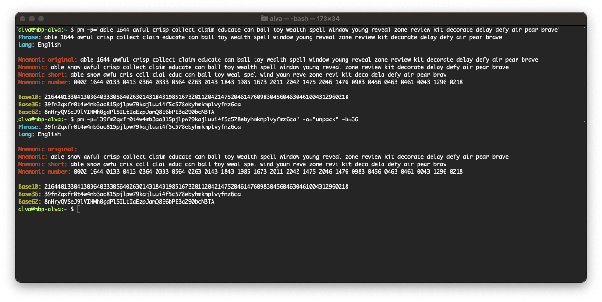

# App pack mnemonic
Console application for pack mnemonic

### [Install](./docs/INSTALL.md)

### Options
* ```--phrase, -p``` - mnemonic phrase
* ```--operation, -o``` - operation (pack/unpack) (default: "pack")
* ```--base, -b``` - base (10/36/62) (default: "10")
* ```--lang, -l ``` - lang (English/Czech/French/Italian/Japanese/Korean/Spanish/ChineseTraditional/ChineseSimplified) (default: "English")

### Run
```shell
pm -p="able 1644 awful crisp collect claim educate can ball toy wealth spell window young reveal zone review kit decorate delay defy air pear brave"
pm -p="39fm2qxfr0t4w4mb3ao815pjlpw79kajluui4f5c578ebyhmkmplvyfmz6ca" -o="unpack" -b=36

```

